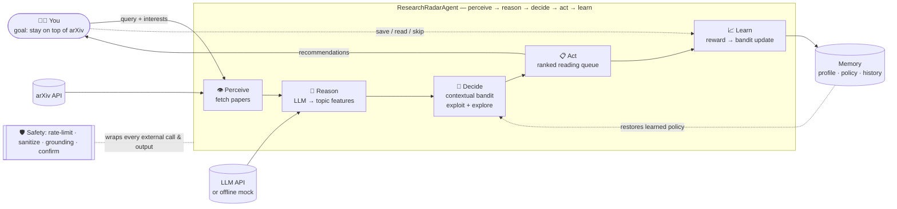
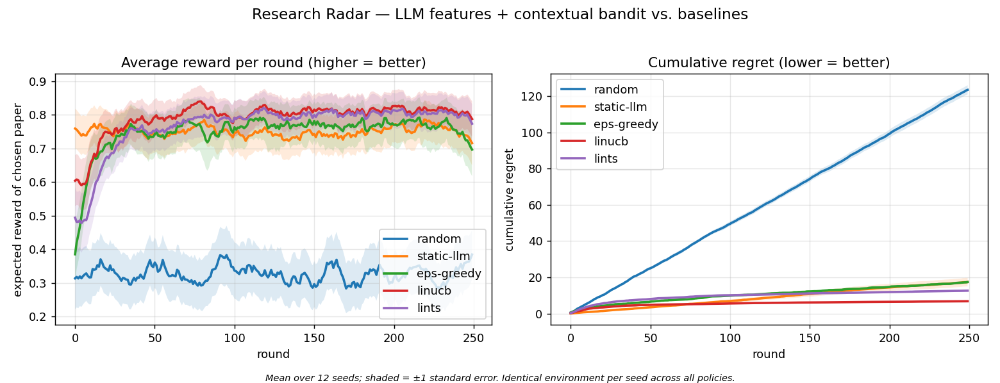

# 🛰️ Research Radar — an LLM + RL agent that learns which papers you care about

> **COMPSCI 767 — Assignment 2 (Build an intelligent software agent).**
> Research Radar perceives a stream of new arXiv papers, **reasons** about each one with an
> LLM, **decides** what to surface using a **reinforcement-learning** policy, and **learns**
> your taste from your feedback so its recommendations improve every session.

It is a deliberately small but complete agent: it **perceives** input, **makes decisions**,
**acts** toward a goal (*keep me on top of the literature that matters to me*), and **updates
from feedback** — using an LLM, external APIs, persistent memory, and safety guards.

📹 **2-minute demo video:** _<add your unlisted YouTube/Drive link here>_

---

## The idea in one picture: LLM + RL, not just an LLM wrapper

A pure-LLM recommender only ever *exploits* — it keeps showing you what looks relevant and
never principled-ly *explores*. Research Radar splits the job the way the course frames it:

* the **LLM is the state encoder** — it turns each unstructured abstract into a structured
  feature vector over a research-topic taxonomy;
* a **contextual bandit (RL) is the decision-maker** — it learns a *personalised* linear
  value function over those features from your feedback, balancing **exploitation**
  (high predicted value) against **exploration** (high uncertainty).



The RL formulation is the classic **contextual-bandit** setting (Sutton & Barto ch. 2;
Li et al. 2010, *A contextual-bandit approach to personalized news recommendation* — swap
"news" for "papers" and that is this agent). Two policies are implemented: **LinUCB** and
**Linear Thompson Sampling**.

---

## Quickstart (zero config, fully offline)

No API key and no network needed — the repo ships a cache of real arXiv papers and a
deterministic mock encoder.

```bash
git clone <your-repo-url> && cd research-radar
pip install -r requirements.txt

# Scripted end-to-end demo (perceive → reason → decide → act → learn, twice). Great for the video:
python -m research_radar.cli demo

# Or drive it yourself:
python -m research_radar.cli init --interests "reinforcement learning, LLM agents, RLHF"
python -m research_radar.cli recommend --query "llm agent reinforcement learning" --top 5 --offline
python -m research_radar.cli feedback <arxiv_id> save     # also: like / read / skip / dislike
python -m research_radar.cli stats                        # shows the learned topic preferences
python -m research_radar.cli reset                        # erase learned state (asks to confirm)
```

`stats` prints the bandit's learned weight per topic — you can literally watch the agent's
model of your taste take shape.

## 🖥️ Web UI (Streamlit) — nicest for the demo video

A point-and-click interface over the *same* agent: type a query, get paper cards, click
👍 / 📖 / 👎, and watch the **learned-preference bar chart update live** as the contextual
bandit adapts to you.

```bash
pip install -r requirements-ui.txt
streamlit run app.py            # then open the printed URL (default http://localhost:8501)
```

Set interests/query in the sidebar, click **🔍 Recommend**, rate a few papers, and watch the
right-hand "what the agent has learned" chart move. (`app.py` is a thin layer over
`ResearchRadarAgent`; the CLI and UI share the same learned state via the memory store.)

## Use a real LLM (optional, nicer for the demo)

```bash
cp .env.example .env          # then add ONE key:
#   ANTHROPIC_API_KEY=sk-ant-...     (default model: claude-haiku-4-5)
#   OPENAI_API_KEY=sk-...            (default model: gpt-4o-mini)
set -a && source .env && set +a       # export the key into your shell

python -m research_radar.cli recommend --query "reinforcement learning from human feedback"
```

The backend is **switchable**: with a key present the agent calls the real model; with no
key it transparently falls back to the offline encoder, so the exact same code reproduces
for a grader. Force offline anytime with `--mock` and/or `--offline`.

## Reproduce the RL evaluation

Does the bandit actually learn — and beat "just trust the LLM score"? Run the simulated-user
experiment (no network, seeded, deterministic):

```bash
python experiments/run_learning_curve.py            # ~10–20 s
# -> results/learning_curve.png  + a summary table
```



**LinUCB / LinTS** climb to near-optimal reward and accrue the lowest regret; **static-LLM**
(rank by the LLM's fixed zero-shot guess, never learns) plateaus; **random** is the floor.
That gap is exactly what the RL component buys.

---

## How it maps to the course (LLM + RL) and the rubric

| Capability (rubric)        | Where in the code |
|----------------------------|-------------------|
| Perceive input             | `research_radar/perception/arxiv_source.py` (live API + offline cache) |
| **LLM reasoning**          | `research_radar/reasoning/encoder.py`, `llm_client.py` (LLM-as-state-encoder) |
| **RL decision-making**     | `research_radar/decision/bandit.py` (LinUCB, LinTS, ε-greedy, baselines) |
| Learn / update from feedback | `agent.learn()` → `bandit.update()` (online) |
| Tools / APIs               | arXiv Atom API, Anthropic/OpenAI HTTP APIs |
| Memory                     | `research_radar/memory/store.py` (profile + policy + history persist across runs) |
| Safety mechanisms          | `research_radar/safety/guards.py` (rate-limit, sanitize, grounding, confirm) |
| Code execution / evaluation| `experiments/run_learning_curve.py` (reproducible RL benchmark) |

## Project layout

```
research_radar/
  perception/arxiv_source.py   # fetch papers (live arXiv + graceful offline cache)
  reasoning/llm_client.py      # switchable Anthropic / OpenAI / mock backend
  reasoning/encoder.py         # LLM → topic feature vector (the RL "state")
  decision/bandit.py           # LinUCB / LinTS / ε-greedy / random / static-LLM
  memory/store.py              # durable JSON: profile, learned policy, history
  safety/guards.py             # rate limiting, input sanitisation, grounding, confirmation
  agent.py                     # perceive → reason → decide → act → learn orchestrator
  simulator.py                 # hidden-preference user for evaluation
  cli.py                       # init / recommend / feedback / stats / demo / reset
app.py                         # Streamlit web UI (optional; nicest for the demo video)
experiments/run_learning_curve.py  # RL benchmark → results/learning_curve.png
data/build_cache.py            # rebuild the offline cache from live arXiv
tests/test_research_radar.py   # bandit-learns, encoder, memory, agent-loop tests
docs/                          # architecture write-up, report draft, demo script
```

## Safety notes (prototype level, stated honestly)

The guards in `safety/guards.py` demonstrate *where* safety belongs in an agent; they are
not production hardening. (1) **Rate limiting** caps API calls. (2) **Input sanitisation**
bounds/cleans queries before they hit an API. (3) **Grounding check** flags summaries that
add numbers absent from the source abstract or run longer than it — a cheap hallucination
tripwire; on a flag the agent falls back to a verbatim extractive summary. (4) **Confirmation**
gates any irreversible action behind a human y/n — e.g. `reset` (which erases learned
preferences) refuses to proceed unless you approve interactively or pass `--yes`. Provenance
(arXiv id + link) is always shown so claims are checkable.

## Tests

```bash
python -m unittest discover -s tests -v      # or: pytest -q
```

Covers: the bandit measurably learns a hidden preference vector and beats random; the mock
encoder produces valid feature vectors; the learned policy round-trips through memory; and
the full reason→decide→learn loop runs offline.

## Configuration

Edit `config.json` (deep-merged over built-in defaults) — taxonomy, bandit hyperparameters
(`algo`, `alpha`, `lam`, `ts_v`), reward mapping, and LLM/model selection. A few values can
also be set via env vars (`RADAR_LLM_PROVIDER`, `RADAR_LLM_MODEL`, `RADAR_BANDIT_ALGO`,
`RADAR_MEMORY_PATH`). See `docs/architecture.md` for the full design rationale.

## License

MIT — see `LICENSE`.
